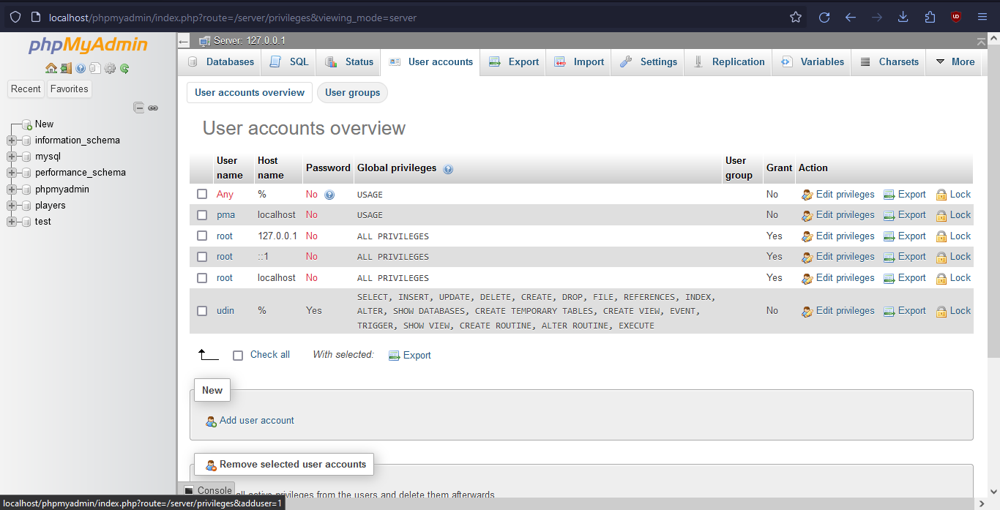

to host this on your xampp server what you need to do are :

1.  git clone this into C:/xampp/htdocs/ (or wherever your xampp/htdocs/ are located)
2.  create a user and a database on your mysql xampp from phpmyadmin (or any database tool to interact with mysql)
you could create a user account on the "user account" section on you phpmyadmin panel

3.  create a "credentials.env" file that contains the user and database details to your mysql db the credentials.env looks like this :
   
        DB_HOST=127.0.0.1
        DB_USER=(your db user name here)
        DB_PASSWORD=(your db user password here)
        DB_NAME=(your db name here)
    
4.  access it on localhost/fwanderer/index.html
